## Methodological note:
This is a research specification, not a results report.
Section 0 below states plainly which numbers are experimental targets versus what has actually been measured - see the [README](https://github.com/rustnew/precog-trainability/blob/main/README.md) for verified findings, including a corrected result and a documented bug.

---

## 0. Methodological disclaimer

All numerical values cited in this document (Recall@10 ≥ 90%, Spearman ρ ≥ 0.90, compute reduction ≥ 70%, data reduction, prediction error ≤ 5–10%, etc.) are **experimental targets to be demonstrated**, not results already obtained. The ablation tables shown as examples are **expected templates**, not real measurements. This document is a research specification, not a results report.

---

## 1. Executive Summary

**PRECOG** is a research system aiming to transform the classic hyperparameter optimization (HPO) problem into a **trainability prediction** problem: from an untrained model, dataset statistics, and a hardware environment, PRECOG seeks to predict — **before any training on real data** — a distribution of learning configurations likely to lead to fast, stable, and data-efficient convergence.

PRECOG does not replace final training. It precedes and guides the configuration search, drastically reducing the number of full training runs needed to find a good configuration.

The project's central statement is:

> **PRECOG does not search for the best hyperparameters after training many configurations; it seeks to learn the relationship between a model's initial state, the properties of the problem, and the learning conditions, in order to predict — before any real training — which configurations have the highest probability of leading to fast, efficient convergence.**

PRECOG is designed as a hybrid architecture combining six complementary families of methods (zero-cost proxies, NEAR-style expressivity analysis, initialization theory, meta-learning, Bayesian optimization, adaptive short validation), organized in a closed continuous-improvement loop built on a meta-dataset of experiments.

---

## 2. Motivation

Classic hyperparameter optimization (grid search, random search, Bayesian Optimization, Hyperband, PBT, etc.) essentially proceeds by **expensive trial and error**: every candidate configuration must be partially or fully trained to be evaluated. This cost becomes prohibitive as models grow.

Part of the recent literature (zero-cost proxies, training-free NAS, NEAR) shows that it is possible to extract informative signals about the potential quality of an architecture or configuration **without full training**, sometimes from a single mini-batch. These results remain fragmentary, however: no proxy is universally dominant, cross-domain generalization (vision → NLP → LLM) remains uncertain, and this work almost always focuses on ranking architectures rather than fully predicting a learning configuration (learning rate, batch size, initialization, scheduler, etc.).

PRECOG starts from the hypothesis that these signals, combined with each other and enriched by experience accumulated across many past training runs (meta-learning), can be exploited to build a **configuration predictor**, not merely an architecture ranking.

---

## 3. Scientific Problem

### 3.1 Informal formulation

> Given an untrained model M, a dataset D (characterized only by its statistics, without training on it), and a hardware environment H, can we predict a learning configuration θ (fine-grained architecture, initialization, optimizer, learning rate, batch size, regularization, scheduler) that maximizes the probability of reaching a target performance, while minimizing the compute, time, and amount of data needed?

### 3.2 Mathematical formulation

$$
\theta^* = \arg\max_{\theta} \; P\big(\text{Convergence} \geq \text{Target} \mid M, D, H, \theta\big)
$$

PRECOG seeks to approximate:

$$
P(\theta^* \mid M, D, H)
$$

**without updating the real model's weights on real data** (see §5 for the strict definition of "without training").

### 3.3 What PRECOG is not

- It is **not** a NAS (Neural Architecture Search) in the strict sense: PRECOG can suggest architecture adjustments, but its core is the learning configuration.
- It is **not** a simple wrapper around a Bayesian optimizer (e.g. Google Vizier): Vizier/BO is an internal component (the search engine), not the whole system.
- It is **not** a performance guarantee: it is a probabilistic system that must express its uncertainty.

---

## 4. Research Hypotheses

- **H1 (Pre-training signal):** the state of an untrained network (gradient, Jacobian, activation, spectrum, initialization statistics) contains exploitable information about its future trainability.
- **H2 (Non-universality of proxies):** no single signal is sufficient on its own; combining several families of signals is more robust than any one alone.
- **H3 (Transferability via meta-learning):** experience accumulated over past (model, dataset, configuration, result) tuples improves prediction on new tuples, via a shared task representation.
- **H4 (Usefulness of short training):** a very short validation run (a few dozen to a few hundred steps) sharply reduces uncertainty on the best predictions, at marginal cost.
- **H5 (Existence of regimes):** the optimal relationships between hyperparameters (e.g. LR* = f(BatchSize)) depend on the learning regime (model size, data noise, architecture), not on a universal constant.
- **H6 (Correlation ≠ causation):** some observed relationships between pre-training signals and final performance are confounded by third variables (the architecture, in particular); some of these must be tested experimentally before being exploited with confidence.

Each of these hypotheses must be tested and potentially refuted by the protocols described in §14.

---

## 5. Operational Definition of "Without Training" — the Three Modes

This is the project's most important methodological constraint: it must be unambiguous.

| Mode | Description | Real model weight update | Usage |
|---|---|---:|---|
| **PURE-PRECOG** | Analysis of the untrained model and the dataset (statistics, forward passes without learning, zero-cost computations, Jacobian, etc.) | **ΔW = 0** | Reference mode for the project's central promise |
| **PROBE** | Very short, controlled training (e.g. 50–1000 steps, 0.1–1% of the total budget) | ΔW ≠ 0, but bounded and logged | Validation/refinement of a PURE prediction |
| **FULL TRAINING** | Complete training | ΔW ≠ 0, unrestricted | Ground-truth generation, never used to "cheat" on the prediction |

**Contract rule (Zero-Training Contract):** any benchmark claiming PRECOG's central promise ("predict without training") must be carried out exclusively in **PURE** mode. **PROBE** mode is an explicitly, separately measured extension: it must always be possible to answer the question "how much does PROBE add over PURE alone, for what additional cost?".

In PURE mode, the operations allowed on the dataset are limited to **descriptive statistics** (size, dimensionality, approximate entropy, class imbalance, redundancy, estimated noise) and, if needed, to **forward passes without backpropagation or weight updates** (to measure activations/Jacobian). No `optimizer.step()` loop is permitted.

---

## 6. Positioning Relative to the State of the Art

| Line of work | Contribution to PRECOG | Acknowledged limitation |
|---|---|---|
| Zero-Cost Proxies (training-free NAS) | Fast signals (SynFlow, SNIP, GraSP, Jacob-Cov…) from a mini-batch | No proxy dominates everywhere; correlations vary widely by domain |
| NEAR (effective rank of activations) | Training-free expressivity signal, useful for choosing activation/initialization | A single signal, insufficient to predict a full configuration |
| Initialization theory / dynamical isometry | Framework for understanding signal and gradient propagation | Results mostly established on simplified cases (deep linear networks) |
| Meta-learning for HPO | Reuse of past experiments as a prior | Strongly depends on the quality and diversity of the meta-dataset |
| Bayesian Optimization, Hyperband, BOHB, PBT, ASHA, Vizier, Optuna | Efficient search engines under a budget | Generally start from a weak or null prior; evaluation cost still high without a pre-training signal |
| Freeze-thaw BO / learning-curve prediction | Progressive resource allocation, early stopping | Already requires partial training observations |

PRECOG positions itself as an **upstream prediction layer** for these search engines: they remain used as **exploration arms**, fed by a far more informed prior.

---

## 7. Fundamental Principles

1. **Observe before testing.** Any information exploitable without training must be exploited before spending compute.
2. **Never depend on a single signal.** Each family of signals compensates for another's weaknesses (see §9).
3. **Predict distributions, not values.** PRECOG returns a probable region with a confidence level, never a point value presented as certain.
4. **Learn conditional functions, not constants.** E.g. LR* = f(Model, Dataset, Initialization, BatchSize, Optimizer), not "LR = 0.001".
5. **Measurable economy.** PRECOG only has value if its total cost (analysis + any probes) remains far below the cost of classic HPO.
6. **Learn from its mistakes.** Every gap between prediction and ground truth is valuable data, kept and exploited, not a result to ignore.
7. **Correlation ≠ causation.** Relationships exploited in production must, as much as possible, be validated by controlled tests.
8. **Generalization above all.** A high score on an already-seen benchmark has no scientific value until it is reproduced on tasks, architectures, and datasets never encountered before.

---

## 8. Full Architecture

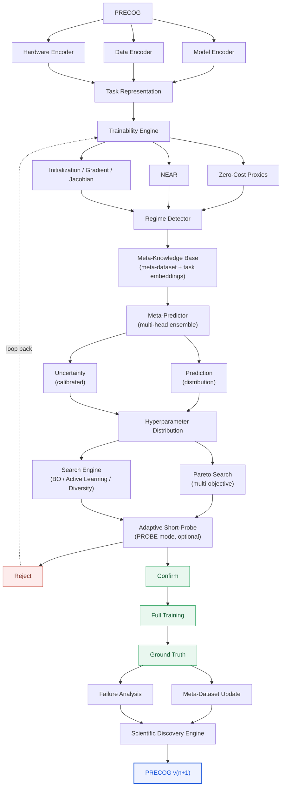

---

## 9. Detailed Components

### 9.1 Model Encoder

Extracts a descriptor vector $X_{model}$ from the architecture alone (no data): depth, width, number of parameters, FLOPs, activation type, normalization, residual-connection ratio, attention structure, required memory.

### 9.2 Data Encoder

Extracts $X_{data}$ from descriptive statistics allowed in PURE mode: size, dimensionality, entropy, estimated noise, class imbalance, feature correlation, redundancy, distribution. Long-term goal: an embedding $Z_D = \text{Encoder}_{data}(D)$ enabling datasets to be compared by similarity.

### 9.3 Hardware Encoder

Captures GPU/CPU, memory, bandwidth, numerical precision, batch capacity, interconnect — because the optimal configuration also depends on the execution environment: $\theta^* = f(M, D, H)$.

### 9.4 Trainability Engine

The system's analytical core. Computes, without any weight update:

- **Zero-Cost Proxies**: SynFlow, SNIP, GraSP, Jacob-Cov, gradient and activation statistics on one or a few mini-batches.
- **NEAR**: effective rank of activations before/after the nonlinearity, as an expressivity indicator.
- **Initialization analysis**: variance of activations and gradients, singular values of the Jacobian $J = \partial f(x)/\partial x$, conditioning $\kappa(J) = \sigma_{max}/\sigma_{min}$, link to dynamical isometry.
- **Curvature** (when measurable at low cost): local Hessian approximations.

Combination rule: $Score_{ZC} = f(S_1, S_2, ..., S_n)$, never a single isolated score.

### 9.5 Regime Detector

Classifies the (model, dataset, hardware) tuple into a learning regime (e.g. small model/clean data, large model/noisy data, low data volume, long sequences). Produces a **regime prior** used to constrain the predicted hyperparameter distribution.

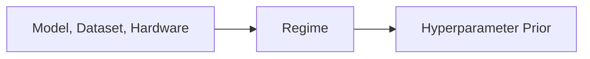

### 9.6 Meta-Knowledge Base

A structured base of all past experiments (see §12), with a **task embedding** mechanism enabling retrieval of the historical experiments closest to a new task, and using that neighborhood as a search prior (experience transfer).

### 9.7 Meta-Predictor

A model (or ensemble of models) taking as input:

$$
X = [X_{model}, X_{data}, X_{ZC}, X_{NEAR}, X_{init}, X_{regime}]
$$

and producing, for each candidate configuration, a multi-head prediction:

- $\hat{A}$: expected performance
- $\hat{T}$: convergence steps/time
- $\hat{C}$: expected compute
- $\hat{N}$: data needed
- an **uncertainty** attached to each head (e.g. via ensembles, quantile regression, or Bayesian approaches)

The result is never a single value but a distribution, for example:

```text
Learning rate
  recommended = 3.5e-4
  range       = [2e-4, 6e-4]
  confidence  = 91%
```

### 9.8 Search Engine (BO + Active Learning + Diversity)

The meta-predictor provides an **informed prior**; the search engine then explores the remaining space. Hybrid acquisition function:

$$
Acquisition = \alpha \cdot \text{Expected Improvement} + \beta \cdot \text{Uncertainty} + \gamma \cdot \text{Diversity}
$$

Google Vizier / Optuna / BOHB play the role here of **exploration arms**, not the system's brain.

### 9.9 Pareto Search (multi-objective optimization)

Rather than seeking a single optimum, PRECOG searches for a **Pareto front** over (performance, compute, data, time, memory, energy):

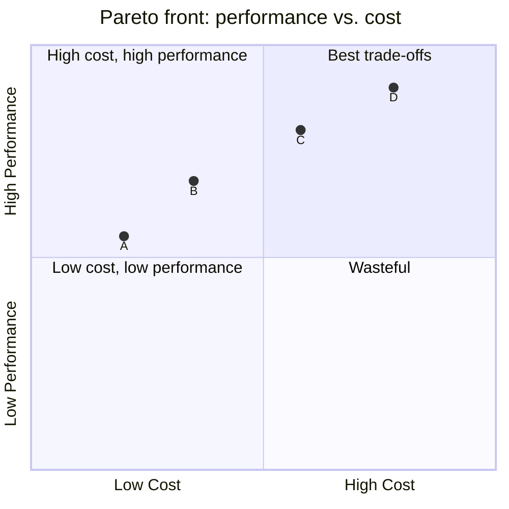

PRECOG can then return several Pareto-optimal configurations, leaving it to the user (human or system) to choose according to their constraints.

### 9.10 Adaptive Short-Probe (PROBE mode)

A short training budget allocated **dynamically** based on uncertainty and intermediate performance:

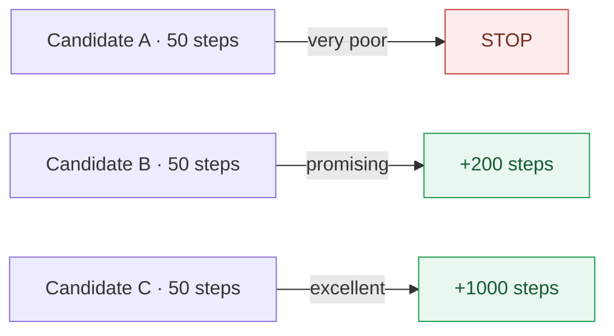

Formalization: $Budget_i = f(Uncertainty_i, Performance_i)$. This mechanism relies on learning-curve prediction (freeze-thaw) to estimate a *time-to-target* and decide CONTINUE/STOP.

### 9.11 Decision Policy

An explicit policy turning PRECOG from a simple predictor into an experimental optimization agent:

$$
Policy(s_t) \rightarrow \{\text{TRAIN}, \text{STOP}, \text{EXPLORE}, \text{EXPLOIT}, \text{REQUEST MORE DATA}\}
$$

### 9.12 Causal Discovery Module

Separates correlation from causation through controlled experiments: with architecture, dataset, and optimizer fixed, a single candidate variable is varied (e.g. the gradient variance induced by initialization) to observe its isolated effect on convergence, rather than concluding from a simple observational correlation.

### 9.13 OOD / Distribution-Shift Detector

Estimates $P(\text{known task})$. If a new task is judged far from the meta-dataset, PRECOG must automatically increase the validation budget (PROBE mode) rather than make an overconfident PURE prediction.

### 9.14 Failure Analysis Engine

Categorizes every significant prediction error:

```text
DATA_SHIFT
ARCHITECTURE_SHIFT
INITIALIZATION_FAILURE
OPTIMIZER_FAILURE
PROXY_FAILURE
PREDICTOR_FAILURE
```

and feeds the improvement cycle (meta-dataset → meta-predictor retraining).

### 9.15 Scientific Discovery Engine

Longer-term goal: turn observed correlations into hypotheses, test those hypotheses through controlled experiments (see 9.12), and derive general principles of trainability from them (e.g. a candidate relationship $LR^* \approx f(\text{BatchSize}, \text{GradientNoise}, \text{ModelScale})$ to be experimentally verified).


---

## 10. Variables and Hyperparameters

### 10.1 Hierarchy of target hyperparameters (of the trained model)

| Level | Family | Variables |
|---|---|---|
| 1 | Architecture | depth, width, hidden dimension, number of heads, activation, normalization, residual connections |
| 2 | Initialization | Xavier, He, Orthogonal, variance/scale, bias init, LSUV |
| 3 | Optimization | optimizer (SGD, Momentum, Adam, AdamW, RMSProp, Lion), learning rate, batch size, gradient accumulation, momentum |
| 4 | Scheduling | warmup, scheduler (cosine, linear, exponential, OneCycle), decay, minimum LR |
| 5 | Regularization | weight decay, dropout, label smoothing |
| 6 | Data | sampling ratio, augmentation, curriculum, amount of data |

### 10.2 PRECOG's internal hyperparameters (strictly distinct from the above)

| Component | Internal hyperparameters |
|---|---|
| Bayesian Optimization | acquisition function, exploration/exploitation coefficient, kernel choice, initial observations |
| Short-Probe | initial number of steps, probe budget, early-stopping threshold, confidence threshold |
| Active Learning | exploration/uncertainty/diversity coefficients |
| Meta-learning | embedding dimension, history size, meta-predictor learning rate |

### 10.3 Principle of conditional functions

PRECOG never learns a universal constant, only conditional relationships:

$$
LR^* = f(\text{Model}, \text{Dataset}, \text{Initialization}, \text{BatchSize}, \text{Optimizer})
$$
$$
\text{Initialization}^* = f(\text{Architecture}, \text{Dataset})
$$
$$
\text{BatchSize}^* = f(\text{ModelSize}, \text{DatasetSize}, \text{LR}, \text{Hardware})
$$
$$
\text{Optimizer}^* = f(\text{Model}, \text{Dataset}, \text{LR}, \text{BatchSize})
$$

and more generally a joint distribution $P(\theta^* \mid M, D, H)$, with an explicit **interaction graph** between variables (e.g. LR ↔ BatchSize ↔ gradient noise; Architecture ↔ Initialization ↔ signal propagation).

---

## 11. The Central Concept: Trainability

### 11.1 Operational definition

$$
\text{Trainability} = f(\text{Gradient}, \text{Jacobian}, \text{Activation}, \text{Curvature}, \text{Conditioning}, \text{Initialization}, \text{Architecture}, \text{Data})
$$

### 11.2 Exploitable signals

- Gradient norm and distribution $\|\nabla_\theta L\|$
- Gradient variance $Var(\nabla_\theta L)$
- Jacobian $J$, its singular values $\sigma_1, ..., \sigma_n$
- Conditioning $\kappa(J) = \sigma_{max}/\sigma_{min}$
- Activation statistics $E[a], Var(a)$
- Local curvature $H = \nabla^2_\theta L$ (approximated, when cost allows)
- Initialization properties and their link to dynamical isometry

### 11.3 Central research question

> Which signals, observable on an untrained model, actually predict the future speed and quality of learning — and which are merely artifacts correlated with the architecture?

This question must be addressed both **predictively** (the meta-predictor) and **causally** (the causal discovery module, §9.12).

---

## 12. The Meta-Dataset: PRECOG's Scientific Memory

Every experiment — including every failure — must be recorded with, at minimum:

```mermaid
flowchart TD
    Exp[Experiment] --> M["Model<br/>architecture, depth, width, params, FLOPs, activation, norm."]
    Exp --> D["Dataset<br/>size, dimension, entropy, noise, imbalance, diversity"]
    Exp --> HW["Hardware<br/>GPU/CPU, memory, precision, bandwidth"]
    Exp --> Init[Initialization]
    Exp --> Opt["Optimizer, LR, batch size, weight decay, scheduler, warmup"]
    Exp --> ZCP["Zero-cost descriptors<br/>SynFlow, SNIP, GraSP, Jacobian, NEAR…"]
    Exp --> Dyn["Training dynamics<br/>gradient norms, loss slope, activation statistics"]
    Exp --> Curve[Full learning curve]
    Exp --> Cost["Steps, compute (GPU-hours), memory, time, amount of data, seed"]
    Exp --> GT["Ground truth<br/>final performance, convergence, real cost"]

    classDef confirm fill:#e9f7ef,stroke:#1f9d55,color:#155c33;
    class GT confirm;
```

Prediction failures are **kept and labeled** (see Failure Analysis, §9.14): they constitute a learning signal at least as valuable as successes.

**Strict separation:** the meta-dataset is partitioned into TRAIN / VALIDATION / TEST, with the TEST set explicitly locked (never used to improve PRECOG), to avoid *benchmark overfitting*.

---

## 13. Experience Transfer and Task Embedding

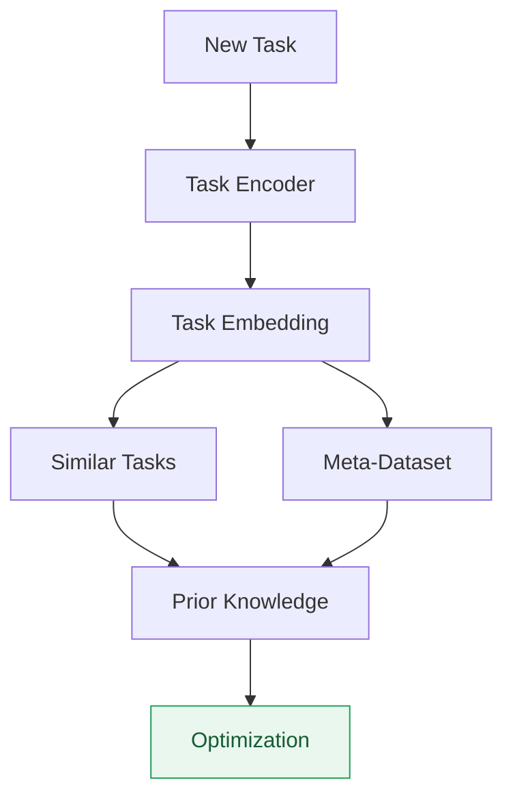

PRECOG must be able to recognize that a new problem "resembles" a problem already encountered and exploit that similarity as a prior, rather than starting from an uninformed search — this is one of the main expected levers for moving from a merely analytical system to a genuinely intelligent one.

---

## 14. End-to-End Experimental Pipeline

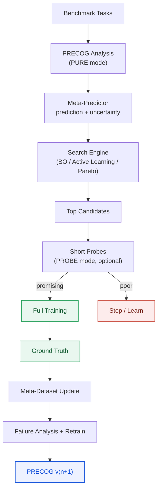

This loop never stops after a single iteration: every PRECOG generation must be compared to the previous one under a strictly identical protocol.

---

## 15. Test Protocols

| Protocol | Question | Main metric |
|---|---|---|
| **P1 — Ranking** | Does PRECOG rank configurations correctly? | Spearman ρ, Kendall τ |
| **P2 — Top-K** | Does it retrieve the best configurations? | Recall@K |
| **P3 — Convergence** | Does the chosen configuration converge faster? | Steps/Time-to-Target |
| **P4 — Compute** | How much compute is saved? | GPU-hours / FLOPs |
| **P5 — Data efficiency** | Same quality with less data? | Samples-to-Target |
| **P6 — Generalization** | Does it work on a never-seen model/dataset? | Out-of-distribution performance |

### 15.1 TRAIN/VALIDATION/TEST separation

```text
PRECOG TRAIN        → known datasets and architectures, experiment history
PRECOG VALIDATION   → different datasets, partially new architectures
PRECOG TEST (locked) → never seen, never used to improve PRECOG
```

### 15.2 Reference benchmarks for the initial phase

- **NATS-Bench** (successor to the now-deprecated NAS-Bench-201): a reference architecture space with pre-computed performance (CIFAR-10, CIFAR-100, ImageNet16-120) — useful for testing ranking without having to train every architecture oneself.
- **NAS-Bench-Suite-Zero / JAHS-Bench / HPO-B**: actively maintained benchmarks, the first specifically designed to evaluate zero-cost proxies (see stack.md §4 for the rationale behind these choices over the now poorly-maintained HPOBench).
- **Synthetic laboratory** (generated in-house): fully controlled datasets and models (noise, entropy, dimensionality, depth, width), enabling candidate causal variables to be isolated before moving to real benchmarks.

### 15.3 Multi-seed and statistical tests

Every important experiment is repeated over several seeds, with mean, standard deviation, and confidence interval (95% CI) computed. Comparisons between methods (PRECOG vs. Random, vs. BO, vs. Hyperband, vs. Vizier) use appropriate statistical tests (e.g. a Wilcoxon signed-rank test rather than a t-test when parametric assumptions aren't guaranteed), to avoid declaring superiority based on a lucky seed.

---

## 16. Metrics and Objectives (to be demonstrated, not guaranteed)

| Metric | Definition | Experimental target |
|---|---|---|
| Ranking correlation | Spearman ρ / Kendall τ between PRECOG's ranking and the real ranking | ρ ≥ 0.80 then ≥ 0.90 |
| Top-K recall | $Recall@K = \|\text{PredictedTopK} \cap \text{TrueTopK}\| / K$ | Recall@10 ≥ 80% then ≥ 90% |
| Compute reduction | $1 - C_{PRECOG}/C_{baseline}$ | ≥ 50% then ≥ 70% |
| Performance retention | $Performance_{PRECOG}/Performance_{oracle}$ | ≥ 99% (or a tolerance defined a priori) |
| Data efficiency | $Samples_{baseline}/Samples_{PRECOG}$ for equal target performance | ≥ 30–50% reduction, to be refined |
| Time/Steps-to-Target | Reduction in time/number of steps to reach a target | ≥ 50% reduction |
| Prediction error (learning curve) | $\lvert \text{Prediction} - \text{Actual} \rvert$ | ≈ 5–10% depending on the metric |
| Generalization | Recall@K on never-seen tasks/architectures/datasets | same order of magnitude as on known data |

These targets are **progression hypotheses**, formalized as successive gates (§17), never presented as already achieved.

---

## 17. Progression Gates

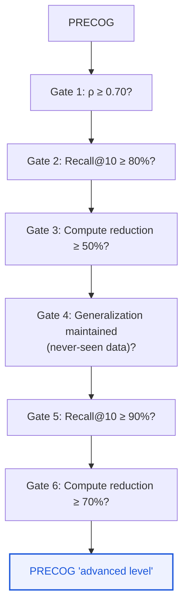

Each gate is validated by independent metrics, on locked datasets, before considering the next generation.

---

## 18. Comparison Baselines

PRECOG must be systematically compared, at equal budget, against:

```text
Random Search       Grid Search
Bayesian Optimization   Hyperband
ASHA                 BOHB
Population Based Training
Google Vizier         Optuna
Zero-Cost NAS (proxy alone)
Meta-learning HPO (without PRECOG's additional layers)
```

along the axes: final performance, compute, convergence speed, data needed, generalization.

---

## 19. Ablation Strategy

### 19.1 Pipeline component ablation


Expected table example (a template, not real results):

| System | Spearman | Recall@10 | Compute used |
|---|---:|---:|---:|
| Random | 0.10 | 10% | 100% |
| ZC | 0.60 | 55% | 10% |
| ZC+NEAR | 0.68 | 64% | 12% |
| +Init | 0.73 | 70% | 14% |
| +Meta | 0.79 | 77% | 16% |
| +BO | 0.82 | 82% | 20% |
| +Adaptive Probe | 0.88 | 90% | 30% |

### 19.2 Individual proxy ablation

SynFlow, SNIP, GraSP, Jacobian, NASWOT, Jacob-Cov, Gradient Norm, NEAR — tested individually then in combination, since the literature shows no proxy is universally dominant.

### 19.3 Robustness testing

Deliberate perturbations: dataset noise and imbalance, distribution shift, model depth/width, activation, seed, batch size, hardware — to verify that PRECOG's performance doesn't collapse outside the meta-predictor's training conditions.

---

## 20. Uncertainty Management

In addition to a prediction, PRECOG must systematically produce:

- a **calibrated uncertainty** (via predictor ensembles, quantile regression, or a Bayesian method),
- a distinction between **model uncertainty** (lack of knowledge), **data uncertainty** (intrinsic ambiguity of the problem), and **training stochasticity** (variance across seeds).

Example output:

```text
Configuration A: prediction = 95%, confidence = 91%
Configuration B: prediction = 94%, confidence = 52%
```

Uncertainty directly feeds the acquisition function (§9.8) and the decision policy (§9.11): an uncertain but potentially informative configuration can be tested with priority to reduce the system's overall uncertainty (active learning).

---

## 21. Causation vs. Correlation

A correlation observed between a pre-training signal (e.g. gradient variance) and final performance can be confounded by a third variable (typically the architecture). PRECOG must therefore:

1. Identify candidate relationships from the meta-dataset's correlations.
2. Formulate explicit hypotheses.
3. Design controlled experiments where only the candidate variable changes (architecture, dataset, and optimizer fixed).
4. Only promote a relationship to "knowledge exploitable in production" after causal validation, or otherwise explicitly mark it as "correlation not causally validated".

---

## 22. Generalization and Distribution-Shift Detection

The generalization test (P6, §15) is considered **the most scientifically important**. It requires:

- training/validating the meta-predictor on a subset of architectures and datasets, then
- testing on architectures and datasets **structurally absent** from the training set (e.g. train on CNN/MLP/ResNet, test on Transformer).

The OOD module (§9.13) must estimate $P(\text{known task})$ and automatically trigger an increase in the validation budget (PROBE mode) when a task is judged far from the meta-dataset, rather than producing an overconfident PURE prediction out of distribution.

---

## 23. Methodological Risks and Mitigations

| Risk | Description | Mitigation |
|---|---|---|
| Data leakage | Real dataset information leaking into the PURE analysis | Strict Zero-Training Contract (§5), audit of allowed features |
| Benchmark overfitting | PRECOG optimized in a loop on the same benchmarks (NAS-Bench-201, HPOBench…) | Locked TEST set, not revealed before final evaluation |
| Meta-dataset bias | Over-representation of certain architectures/domains | Diversification curriculum, explicit tracking of meta-dataset coverage |
| Undetected distribution shift | PRECOG applied outside its domain of validity without warning | OOD module (§9.13) + adaptive validation budget |
| Training stochasticity | Confusing seed variance with a configuration's real effect | Mandatory multi-seed runs, confidence intervals (§15.3) |
| Poorly calibrated uncertainty | Displayed confidence not reflecting the real error | Regular calibration, calibration tests (e.g. reliability diagrams) |
| PRECOG's own excessive cost | Analysis cost exceeds the savings achieved | Systematic measurement of $Cost_{PRECOG} + Cost_{PROBE}$ vs. $Cost_{classic\ HPO}$ (§24) |
| Misleading correlation | A relationship exploited in production isn't causal | Causal discovery module (§21) |
| Dependence on one architecture family | Good performance only on the meta-dataset's architectures | Progressive curriculum (MLP → CNN → Transformer → unknown), strict generalization tests |

---

## 24. System Economics

PRECOG only has practical value if:

$$
Cost_{PRECOG} + Cost_{PROBE\ if\ any} \; \ll \; Cost_{classic\ HPO\ or\ multiple\ FULL\ TRAININGs}
$$

This constraint must be measured at every evaluation, not merely assumed. A system that is theoretically accurate but whose inference is too costly (e.g. a meta-predictor that itself requires enormous compute) must be considered an economic failure, even with a good ranking score.

---

## 25. Development Roadmap

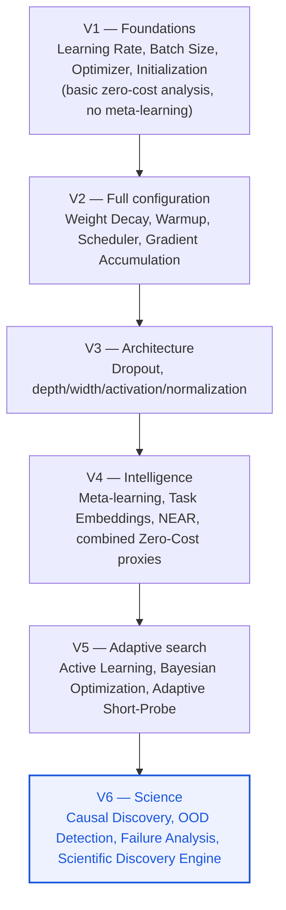

### Scientific progression by phase (indicative)

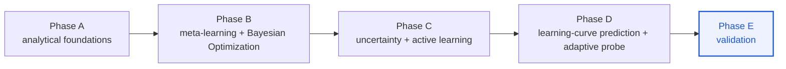

### Experimental curriculum

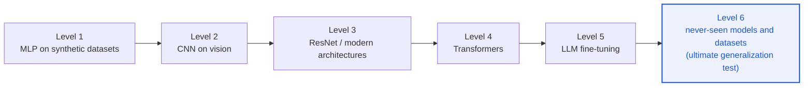

---

## 26. Success Criteria

A PRECOG milestone is only considered reached if, **simultaneously**, on a locked test set never used for training:

1. the ranking (Spearman ρ) reaches the target threshold for the level considered,
2. Recall@K reaches the target threshold,
3. the measured compute reduction reaches the target threshold,
4. the retained final performance stays within the tolerance for loss defined a priori,
5. results hold on never-seen tasks/architectures/datasets (generalization),
6. results are reproducible (multi-seed, confidence intervals, documented environment).

A system that reaches only part of these criteria (e.g. good ranking but poor generalization) is **not** considered to have reached the milestone.

---

## 27. Known Limitations

- Generalization to radically new architecture families (beyond those represented in the meta-dataset) is not guaranteed and must be treated as a hypothesis to test, not as a given.
- Current zero-cost signals from the literature are not universally reliable; combining them reduces but does not eliminate the risk.
- The meta-dataset's quality intrinsically bounds the meta-predictor's quality: a poorly diversified meta-dataset will produce overly optimistic predictions outside its real coverage.
- PROBE mode introduces a real cost, even if minimal; any claimed gain must be net of this cost.
- The causation/correlation distinction remains partial: some exploited relationships will in practice remain robust correlations rather than demonstrated causes, and must be presented as such.

---

## 28. Outlook

In the longer term, PRECOG's scientific ambition goes beyond HPO: the goal is to build an operational theory of **predictable learning dynamics**, i.e. a function

$$
F : (\text{Model}, \text{Data}, \text{Initialization}, \text{Hyperparameters}) \rightarrow \text{Training trajectory}
$$

able to anticipate the loss trajectory $L(t)$ before full training. If this direction succeeds, PRECOG would stop being just a hyperparameter optimizer and become a **predictive model of learning dynamics**, with potential for its own scientific contribution (beyond integrating existing tools).

---

## 29. Production Architecture (long-term target)

PRECOG, as a platform, must be able to:

1. Receive an untrained model, the dataset's allowed metadata/statistics, and a description of the hardware environment.
2. Run an analysis in **PURE** mode (no weight update on real data).
3. Produce a **hyperparameter distribution** with justification and confidence level, as well as a **Pareto-optimal set** of configurations according to constraints (performance/compute/data/time).
4. On request, validate the best hypotheses via a minimal budget in **PROBE** mode.
5. Systematically log the experiment (including production usage) into the meta-dataset, for continuous improvement.

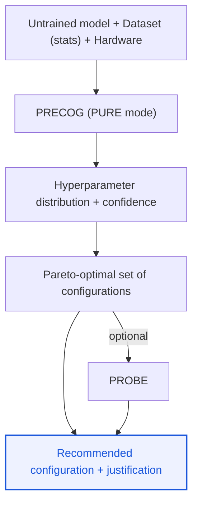

---

## 30. Synthesis — the idea that distinguishes PRECOG from classic HPO

> **PRECOG does not simply search for the best hyperparameters after training many configurations; it seeks to learn the relationship between a model's initial state, the properties of the problem, and the learning conditions, in order to predict — before any training on real data — which configurations have the highest probability of leading to fast, efficient convergence.**

Every evaluation, every benchmark, and every scientific communication about PRECOG must come back to this test: does the system provide information exploitable **before** training, that is measurable, generalizable, and economically justified — or does it merely reproduce classic HPO dressed up differently?
